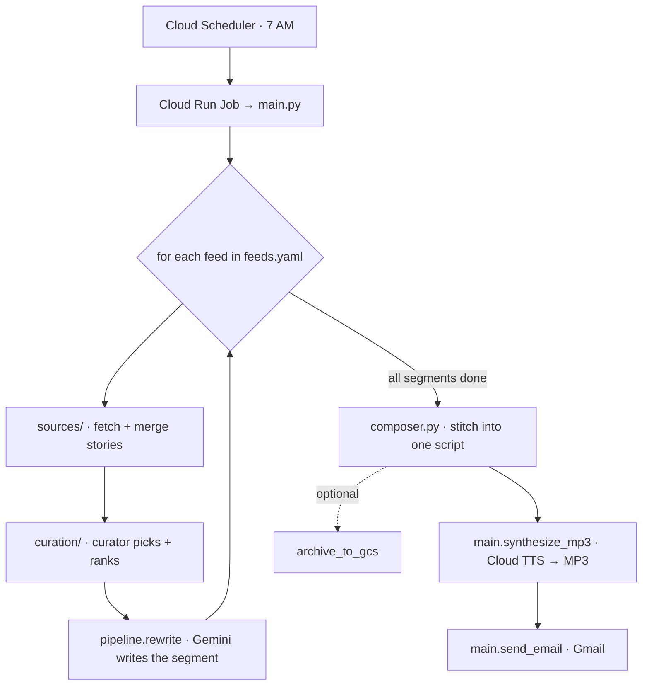
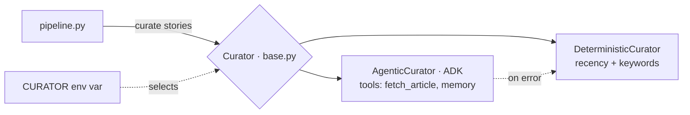

# ARCHITECTURE — Daily_News
`Daily_News` · updated 2026-09-19 · _how the app fits together. Update when the structure changes._

**In one line:** every morning it pulls news from several sources, an LLM rewrites it into a spoken script, turns that into audio, and emails me the clip.

> The diagram below is [Mermaid](https://mermaid.js.org/). It renders as a graph on GitHub automatically, or in VS Code with the "Markdown Preview Mermaid Support" extension.

## The flow (what happens each run)

**In plain words:**
1. A timer (Cloud Scheduler) starts the job → runs `main.py`.
2. `main.py` reads the feed list from `feeds.yaml`.
3. For each feed: **fetch** stories from its sources → **curate** (pick the good ones) → **rewrite** into a spoken segment with Gemini.
4. `composer.py` stitches all segments into one script (greeting + transitions + sign-off).
5. `main.py` turns the script into an MP3 (Cloud TTS) and emails it. Optionally archives to GCS.

## How a curator plugs in (the swappable brain)

## Where things live
| Path | Its job |
|---|---|
| `main.py` | Entry point. Orchestrates, then TTS + email + archive. |
| `pipeline.py` | The core loop: gather → curate → rewrite → compose. |
| `config.py` | Loads settings (env vars) + the feed list from `feeds.yaml`. |
| `feeds.yaml` | **The knobs.** Topics, sources, word budgets. Edit here to change what the briefing covers. |
| `sources/` | One adapter per source (TLDR AI web, Gmail, Google News, Hacker News, stocks). All return a `Story`. |
| `curation/` | The swappable brain: `deterministic.py` + `agentic.py`, both behind `base.Curator`. |
| `composer.py` | Joins segments into the final spoken script. |
| `memory.py` | Cross-run memory (what past digests covered) — used by the agent. |
| `prompts/` | One rewrite prompt per topic + `_shared_style.md`. Decides *how* each segment sounds. |
| `evals/` | Quality testing: golden sets, LLM-judge, expectations grading, compare. |
| `deploy.sh` / `Dockerfile` | Package + ship to Cloud Run. |

## Key ideas (the patterns)
- **`Story`** — one normalized shape every source returns, so the rest of the app doesn't care where news came from. (*adapter pattern*)
- **`Source`** — a contract: any source implements `fetch() → [Story]`. Add one = new file in `sources/`.
- **`Curator`** — a contract for the brain: `curate(stories) → chosen stories`. Two versions, picked by `CURATOR`. (*strategy pattern*)
- **`feeds.yaml`** — config, not code. New topic = new entry here.
- **Evals** — grade a segment two ways: vs the sources, and vs my hand-written `expectations.md`.

## How to extend
- **Add a source** → new file in `sources/` implementing `fetch()`, register it, reference it in `feeds.yaml`.
- **Add a topic** → add a feed block in `feeds.yaml` + a prompt in `prompts/`. No code.
- **Change the brain** → `CURATOR=deterministic|agentic`, or add a strategy in `curation/`.
- **Change voice / length** → `TTS_VOICE` env; `length_budget_words` per feed.
